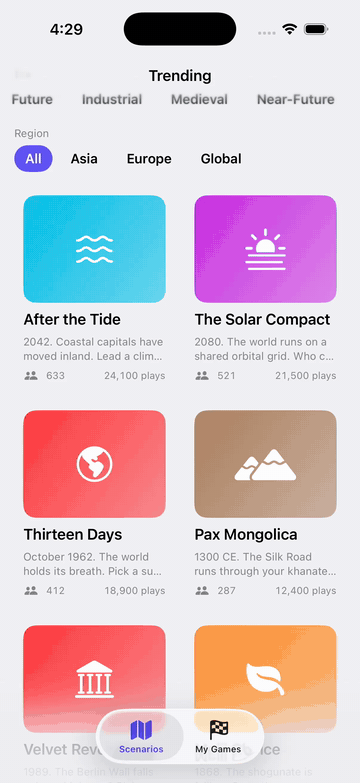

# Pax Companion

<p align="center">
  
</p>

A SwiftUI iOS companion app for [Pax Historia](https://paxhistoria.co)
that **does not try to play the game**. It surfaces game state — your
nation, your turn, world events — through the iOS surfaces that web can't
reach: Home Screen widget, Dynamic Island Live Activity, APNs push, and
a `SwiftUI` `ImageRenderer` share card for X / TikTok.

The intent: ship the iOS notification + retention surface in 4–6 weeks
while the Founding Engineer (Unity Mobile) takes 6+ months to build the
playable client. Pure complement, zero overlap.

## Why this exists

Pax Historia is web-only with 35K DAU and 4,000+ creator presets. Players
on TikTok are publishing "how to play Pax Historia on phone" tutorials —
the demand for mobile is so strong that they're improvising it on
desktop-first responsive web. But the *real* mobile pain isn't playing —
it's **not knowing your game ticked**.

Your alt-history Soviet Union has just gone 16 turns since you checked.
There's no push notification, no widget, no Dynamic Island ping when
France declares war. The 6-month Unity build window is 6 months of
losing players to "I forgot about that round."

This companion app closes that gap immediately.

## What's wired

### Home Screen Widget — [`PaxCompanionWidget/GameStatusWidget.swift`](PaxCompanionWidget/GameStatusWidget.swift)
WidgetKit widget in three sizes: `systemSmall`, `systemMedium`,
`accessoryRectangular` (lock-screen). Shows your nation flag, current
turn, stability bar, and minutes-since-last-tick. Reads from App Group
storage that the host app keeps in sync after every push.

### Live Activity + Dynamic Island — [`PaxCompanionWidget/GameLiveActivity.swift`](PaxCompanionWidget/GameLiveActivity.swift)
`ActivityKit` activity with full Lock Screen, expanded Dynamic Island,
compact, and minimal presentations. Headline + detail are pushed straight
from the event stream — `"War declared"` + `"United States declared war on Cuba"`,
with the SF Symbol that matches the event kind.

### APNs Push — [`PaxCompanion/Push/PushService.swift`](PaxCompanion/Push/PushService.swift)
Permission request + token registration + `Activity<GameAttributes>`
lifecycle. The `ingest(event:for:)` entry point is the same wiring the
real APNs push handler would use — events arrive, the activity updates,
the user sees the notification in-place instead of swiping away a banner.

### Scenario Browser — [`PaxCompanion/Views/ScenarioBrowserView.swift`](PaxCompanion/Views/ScenarioBrowserView.swift)
Grid of trending presets, era + region filter chips, per-card stats. Tap
through → preset detail → "Open in browser" deep-links to
`paxhistoria.co/p/{id}`. Zero new backend work needed from Pax — it
consumes whatever `/api/presets` ends up exposing.

### Share Card — [`PaxCompanion/Share/ScenarioShareCard.swift`](PaxCompanion/Share/ScenarioShareCard.swift)
SwiftUI `ImageRenderer` produces a 600×600 PNG of your current run —
nation flag, preset title, latest event, turn, stability, watermark.
Plays directly into the Short-Form Content Creator hire that's also
listed on the Pax jobs page.

### Read-only PaxAPI client — [`PaxCompanion/API/PaxAPI.swift`](PaxCompanion/API/PaxAPI.swift)
Protocol + `MockPaxClient` that returns 6 hand-crafted alt-history
presets and 2 active games with realistic event logs. When the official
REST API ships (the Unity Mobile JD confirms it's planned), only one
file — `LivePaxClient.swift` — needs to be added.

## Architectural choices worth flagging

- **Companion, not client.** No map renderer, no canvas, no Metal view.
  The Unity hire owns the playable surface; this app owns the awareness
  surface.
- **Widget extension hosts both** `StaticConfiguration` (home screen)
  and `ActivityConfiguration` (Live Activity). Single extension target
  avoids the bundle-id-prefix dance and matches Apple's recommended layout.
- **Push handler ↔ widget storage.** `App Group` shared container is the
  intended sync point — when an APNs push lands, the handler decodes the
  payload, writes the latest `GameStatusEntry` to the App Group, and calls
  `WidgetCenter.shared.reloadTimelines(ofKind:)`. Implementation hook
  marked in `GameStatusWidget.swift`.

## How to plug in the real Pax API

The mock client lives at [`PaxCompanion/API/MockPaxClient.swift`](PaxCompanion/API/MockPaxClient.swift).
Every method maps 1:1 to a future REST endpoint, documented in comments:

```
trendingPresets()       -> GET  /api/presets?sort=trending
myGames()               -> GET  /api/users/me/games
events(forGame:since:)  -> GET  /api/games/:id/events?since=...
```

Swap `MockPaxClient()` in `PaxCompanionApp.swift` for `LivePaxClient(baseURL: …)`
and the rest of the app keeps working unchanged.

## Run locally

```
xcodegen generate
open PaxCompanion.xcodeproj
# Cmd+R on iPhone simulator
# Long-press home screen → + → Pax Companion to drop in the widget
```

The demo runs entirely against the mock — no backend, no API key.

## Stack

iOS 17 · Swift 5.9 · SwiftUI · WidgetKit · ActivityKit · UserNotifications ·
ImageRenderer · no third-party deps

## Who built this

Sushanth Tiruvaipati. Solo iOS dev, 15+ App Store apps shipped — including
Audexa (CarPlay + Live Activities), ReadAloud AI (background streaming),
and ScribeAI (push notifications + APNs at scale).
